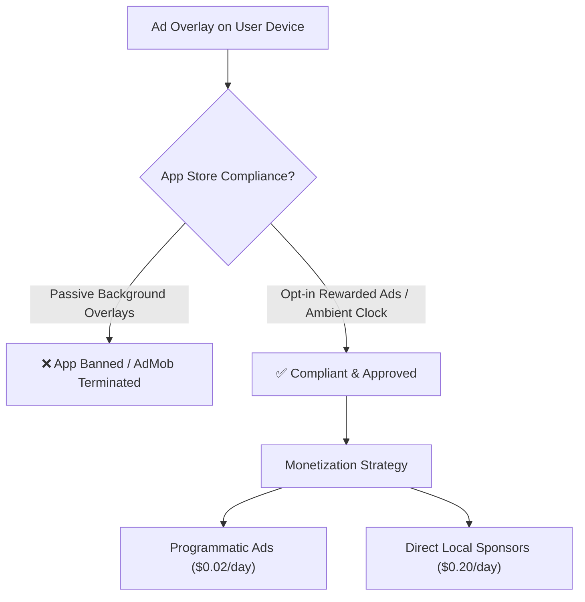

# 💡 Business & Technical Analysis: Single-User Paid Ad Overlay Model

## Executive Summary

Extending your TV signage platform to **individual personal devices (smartphones, tablets, personal TV boxes)** where users earn micro-rewards for viewing ad overlays is an intriguing concept, but it comes with **critical app store compliance, ad network fraud policies, and low CPM unit economics** that must be carefully navigated.

---

## 1. 🔍 Detailed Risk & Feasibility Breakdown

| Category | Risk Level | Details & Impact |
| :--- | :---: | :--- |
| **Google Play / App Store Policy** | 🔴 **CRITICAL** | App stores ban apps that draw continuous ad overlays (`SYSTEM_ALERT_WINDOW`) or pay users for passive ad impressions. |
| **Ad Network Banning (AdMob/Meta)** | 🔴 **CRITICAL** | Mainstream ad networks (Google AdMob, Meta, Unity) classify incentivized passive impressions as **Ad Fraud / Invalid Traffic** and permanently terminate accounts. |
| **Unit Economics (Ad Payout vs Revenue)** | ⚠️ **HIGH** | Average global mobile CPM is **$0.50 – $2.00 per 1,000 ads**. 50 ads/day yields only **~$0.05/day** in gross revenue, leaving almost zero margin after payout processing fees. |
| **Bot & Emulator Fraud** | ⚠️ **HIGH** | Click farms and emulators will attempt to run 100s of fake background instances to drain payout pools. |

---

## 2. 🚀 The Compliant & Profitable Blueprint

To execute this idea safely without getting banned by Google Play or ad networks, use these **3 proven alternative models**:

### Model A: "Watch & Earn" Interactive Rewards (Compliant Rewarded Ads)
- **Concept**: Users voluntarily open the app to watch short 30-second sponsored video ads, answer quick brand polls, or explore local venue deals.
- **Rewards**: Earn mobile airtime credits, digital gift cards, or venue discount vouchers.
- **Why it works**: Uses official **Google Rewarded Video Ads**, which explicitly allow paying/rewarding users for attention.

### Model B: "Personal Ambient Smart Screen" Mode (Charging Desk Display)
- **Concept**: When a user docks their phone or tablet on a desk/bedside charger, the app displays a beautiful ambient clock, weather forecast, news ticker, and subtle brand showcase slides.
- **Rewards**: Gamified streak points redeemable at local partner restaurants, cafes, and gyms.

### Model C: Direct Merchant Ads (Hyper-Local Ad Network)
- **Concept**: Instead of relying on low-paying programmatic ad networks, local businesses (restaurants, gyms, lounges) pay $50–$300/month to sponsor ads on both **Venue TVs** AND **Local App Users' Screens**.
- **Why it works**: Direct merchant revenue yields **10x higher payouts per ad**, making user daily payouts financially sustainable.

---

## 🛠️ Comparison Matrix

